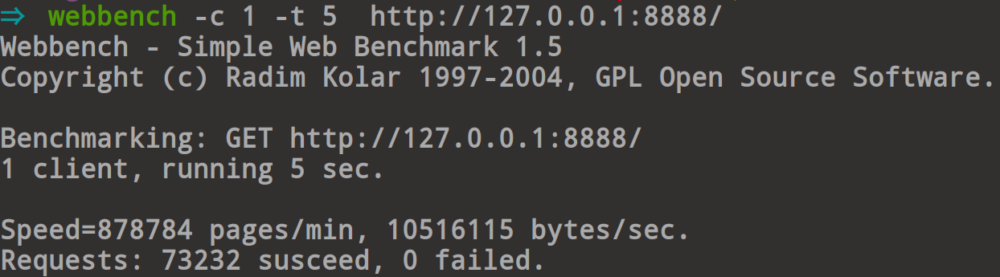
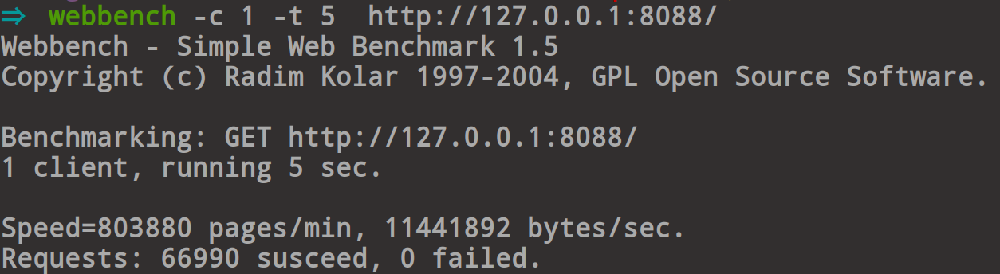

### ck_webServer介绍

ck_webServer是一个小型web服务器，使用c++11编写！实现了GET、POST方法，以及动态网页处理功能。

### 运行环境

- 系统：ubuntu19.10
- 处理器：Intel® Core™ i5-7300HQ CPU @ 2.50GHz × 4
- 内存：7.7 GiB
- 编译器：gcc version 8.3.0

### 技术点

- 基于Reactor网络模型，使用SO_REUSEPORT，创建多监听套接字，分别加入到多个线程的Epoll中，提供服务。
- 设置事件类型为非阻塞LT模式，设计用户缓冲区，处理EAGIN和EWOULDBLOCK错误。
- 使用单实例模式，多队列对象池为新来的连接创建对象。
- 设计进程池CGI服务器在后台运行，处理动态网页提交的数据。使用FastCgi协议与后台php服务引擎进行通信。
- 小文件使用sendfile实现“零”拷贝发送，大文件使用mmap获取文件数据，并发送。
- 动态请求的数据发送使用chunk编码。
- 使用智能指针对对象进行管理，有效避免内存泄漏。

### 实现的功能

静态网页支持传输视频，音频，文档，pdf，pptx等。
动态网处理，像php，表单数据的处理该服务器都支持！

### 目录说明

|名称|作用|
|:---:|:---:|
|webServer|web服务器|
|cgiServer|进程池CGI服务器|
|image|服务器介绍相关的图片|
|conf|配置目录|
|log|日志目录|

### 配置说明

**需要安装RapidJSON**

```
{
    "以下信息填写说明":"填写字符串需要加双引，填写整型数字不加，日志文件路径为绝对
    "ip addr":"127.0.0.1",
    "port":8888, //服务器端口号
    "thread(s) number":5, //开启的线程数量
    "FastCGI dir path":"/root/ck_webServer/www/", //FastCGI程序所在的目录
    "php-fpm ip addr":"127.0.0.1", //php-fpm的ip地址
    "php-fpm port":9000,    //php-fpm 的端口地址
    "log file":"../log/info.log",  //日志文件名称
    "object number":15     //每个对象池初始化时的对象数量
    "cgi ip":"127.0.0.1",  //CGI服务器的IP地址
    "cgi port":8001, 　    //CGI服务器的端口
    "cgi source path":"../cgiSource",  //CGI服务器资源的路径
    "process number":3　　 // CGI服务器的进程数量
}
```

### 使用说明

进入src目录

sudo apt-get install cmake(已经安装的话跳过)

cmake

cmake CMakeLists.txt

make

./Server

### 性能测试

使用webbench进行测试，和nginx服务器性能作了对比如下。

***[]中是待填写内容***

webbench -c [客户端数量] -t [运行时间] http://[IP]:[PORT]/


##### 单线程的ck\_webServer性能

每分钟响应的请求数量：878784（qpm越大说明响应速度越快，性能越高）



##### 单进程的ngnix性能

每分钟响应的请求数量：803880 




##### 多线程的ck_webServer和多进程nginx性能比较

***nginx设置进程数 = ck_webServer设置线程数目 = 5***

测试方式：在开启服务器的情况下，执行以下命令，时间保持15s不变。
(并在同样的情况下测试nginx)

给出下面测试数据


性能对比：


### 总结

在开发中，总共迭代了三版，这一版性能最佳，另外两版分别是
基于多线程one loop per thread网络模型和Reactor模型（对这
些版本感兴趣的同学可以在以前的commit中找到学习）。在不停
的迭代中也学习到了很多新技术，最后感觉学习技术一定要投入
热情，有热情才会有足够的动力去驱使你不断探索新方法。然后
将系统实现的更好。
