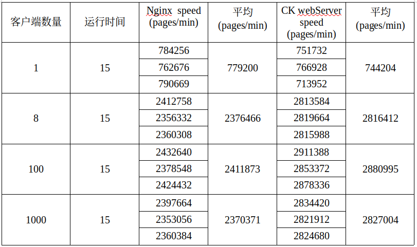
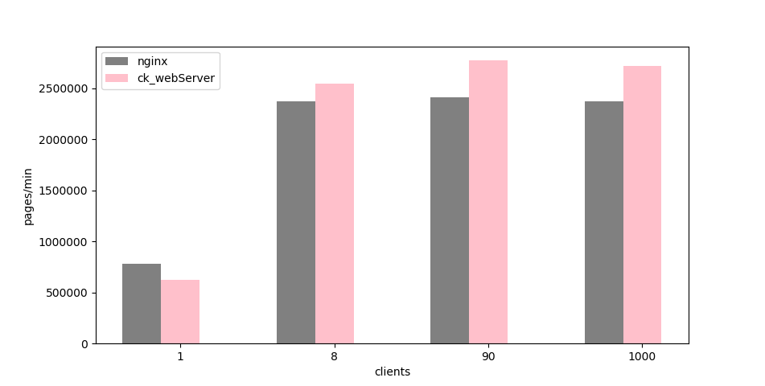

### ck_webServer介绍

ck_webServer是一个小型web服务器，使用c++11编写！实现了GET、POST方法，以及动态网页处理功能

### 运行环境

- 系统：ubuntu19.10
- 处理器：Intel® Core™ i5-7300HQ CPU @ 2.50GHz × 4
- 内存：7.7 GiB
- 编译器：Gcc编译器，Vim+Vimplus编写，使用CMake自动生成Makefile

### 技术点

- 基于Reactor网络模型，使用SO_REUSEPORT，创建多监听套接字，分别加入到多个线程的Epoll中，提供服务
- 设置事件类型为非阻塞LT模式，设计用户缓冲区，处理EAGIN和EWOULDBLOCK错误
- 使用单实例模式，多队列对象池为新来的连接创建对象
- 设计进程池CGI服务器在后台运行，处理动态网页提交的数据。使用FastCgi协议与后台php服务引擎进行通信
- 小文件使用sendfile实现“零”拷贝发送，大文件读到缓冲区后发送
- 使用智能指针对对象进行管理，有效避免内存泄漏

### 实现的功能

静态网页支持传输视频，音频，文档，pdf，pptx等(已经部署到[个人购买的商业服务器](http://changke.fun:3065/)中得到应用)。
动态网页处理，像php，表单数据的处理服务器都支持！

### 目录说明

|名称|作用|
|:---:|:---:|
|webServer|web服务器|
|cgiServer|进程池CGI服务器|
|image|服务器介绍相关的图片|
|www|服务器资源目录|

### 使用说明

进入src目录

sudo apt-get install cmake(已经安装的话跳过)

cmake

cmake CMakeLists.txt

make

./Server或./Server IP PORT

### 性能测试

使用webbench进行测试，和nginx服务器性能作了对比如下。

测试方式：在开启服务器的情况下，执行以下命令，时间保持15s不变。

***[]中是待填写内容***

webbench -c [客户端数量] -t [运行时间] http://[IP]:[PORT]/

给出下面测试数据，并将平均值获取到，绘制成条形图进行对比

性能对比：

