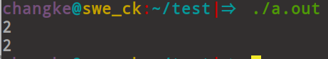
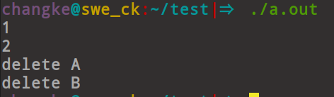

- tatic关键字的所用：
可以加在全局变量之前，也可以加在局部静态变量之前，加载全局静态变量前面，则为全局静态变量，静态存储区，在整个程序运行期间一直存在。
初始化：未经初始化的全局静态变量自动初始化为0（自动对象的初始值是任意的，除非显式初始化）
作用域：全局静态变量在声明他的文件之外是不可见的，准确的说是从定义之处开始，到文件结尾。
- 局部静态变量
在局部静态变量之前加上关键字static，局部变量就成为一个局部静态变量。
内存位置：静态存储区，在变量初始化的时候被初始化成0
作用于：在从声明处开始，到相应的局部作用域结束为止
- 静态函数：在函数返回值前面加上static，函数就定义为静态函数。函数定义合计声明在默认情况下是extern，但是静态函数在声明他的文件是可见的
不会被其他文件所用
函数实现使用static 修饰，那么这个函数在本cpp内使用，不会和其他的cpp中的同名函数的冲突
不要头文件中声明static的全局函数，不要在cpp内部声明非static函数
- 类的静态成员
静态成员函数和静态数据成员一样，他们属于类的静态成员，他们不是对象成员，因此，对静态成员引用不需要用到对象名称
- c++和c的区别
C++是面向对象语言，C是面向过程语言
C++具有封装、继承、多态的特性
C++相比于C，增加了许多安全的功能，比如，强制类型转化
C++支持范式编程，比如模板类、函数模板等

- C++中static关键字的作用

在普通全局/局部变量前声明static函数，生存期直到程序运行结束，都存储在静态存储区
对于在类中声明static 函数和static 成员，则相应的方法和相应的成员变量是属于这个类的，在使用时通过类名和相应的变量或方法名称
进行访问

- C++中的四种cast
C++中的cast类型：static_cast，dynamic_cast、const_cast、reinterpret_cast

const_cast
用于将const变量转为非const
satic_const用于隐式转化，讲非const变量转化成const变量
    
四种智能指针
C++标准库的四种智能指针

auto_ptr、unique_ptr、shared_ptr、weak_ptr

auto_ptr在赋值之后，源对象就会无效，在后面可能造成程序崩溃

unique_ptr独占式智能指针，在初始化后，不能被赋值给其他同类型的智能指针
也就是在实现上消除了该智能指针对象的赋值等操作
但是对于临时产生的对象是允许重新赋值的
```c
unique_ptr<string>aa = unique_ptr<string>(new string("hello"))
unique_ptr<string>bb = aa;   //赋值操作不允许

unique_ptr<string>bb ;//复制操作允许
bb = unique_ptr<string>(new string("hello")) ;
```

shared_ptr
实现共享式的概念
多个智能指针可以指向同一个对象，该对象和和其他相关的资源会在最后一个引用被销毁的时候被释放

判断一个数是二的倍数，求一个数中有几个1？
判断二进制末尾是不是0，a%2==0或者a&0x0001==0

指针和数组区别：
指针是保存数据的地址   数组保存数据
指针间接访问数据，首先获得指针内容，然后将其作为地址，从该地址中提取数据
数组：直接访问数据
通常指针用于动态的数据结构，数组通常用于固定数目且类型相同的元素
通过malloc分配内存，数组隐式的该分配和删除
指针通常指向匿名数据，操作匿名函数，数组自身就是数据名

野指针？
指向一个已经删除的对象或者未申请访问权限内存区域的指针

描述智能指针？
智能指针主要适用于管理堆上分配的内存，他将普通的指针分装成一个栈对象。当栈对象
的生存期结束后，会在西沟函数中释放掉申请的内存，从而防止了内存泄漏。C++11中常用的智能指针类型
为shared_ptr，它采用引用计数的方法，记录当前内存资源被多少指针引用，该引用计数的内存在堆上分配，
当新增一个时引用计数会增加1，当过期时引用计数会减一。只有引用计数为0时，智能指针才会释放掉引用的内存
资源。对shared_ptr进行初始化的时候不能将一个普通指针直接赋值给智能指针，因为一个是指针，一个是类，
可以通过make_shared函数或者构造函数传入普通指针，并可以通过get函数获得普通指针。

智能指针的内存泄露？
使用shared_ptr的时候用户可能会使对象之间进行循环引用，使得两个对象都无法得到释放。导致内存泄漏！
像下面程序：
```c
#include <iostream>
#include<memory>
using namespace std ;
class A ;
class B ;

class A {
public :
    A() {}
    ~A() {
        cout << "delete A" << endl ;
    }
    shared_ptr<B> pb ;
} ;
class B {
public :
    B() {}
    ~B() {
        cout << "delete B" << endl ;
    }
    shared_ptr<A> pa ;
} ;

void func() {

    shared_ptr<A>aptr(new A()) ;
    shared_ptr<B>bptr(new B()) ;
    aptr->pb = bptr ;
    bptr->pa = aptr ;
    cout << aptr.use_count() << endl ;
    cout << bptr.use_count() << endl ;
}
int main() {

    func() ;
    return 0;
}   
```
运行结果:



将A或者B类中的任一个shared_ptr修改成weak_ptr运行结果:



指针和引用的区别？

引用就是某一个变量的别名，对引用的操作相当于对变量的直接操作。引用的声明方法：类型&引用名=目标变量名
引用引入了对象的同义词。定义引用的表示方法与定义指针相似，指示使用&代替\*
区别：
指针有自己的一块空间，而引用只是一个别名
使用sizeof看一个指针大小是4，而引用是对象的大小
指针初始化为NULL，而引用必须被初始化，并且必须是一个已有对象的引用
作为传递参数的时候，指针需要被解引用草可以对对象进行操作，而直接对引用的修改都会改变引用所指向
的对象
指针在使用中可以指向其他对象，但是引用只能是一个对象
指针可以有多级，但指针只能有一级
指针和引用使用++运算符的意义不一样
如果返回动态内存分配的对象或者内存，必须使用指针，引用可能引起内存泄漏

- C++继承中，父类析构函数为什么是虚函数？
编译器总是根据类型来调用类成员函数，但是一个派生类的指针可以安全地转换成
一个基类的指针，这样删除一个基类指针的时候，C++不管这个指针指向基类还是指向
一个派生类对象，调用的都是基类的析构函数，如果以来派生类的析构函数的代码来释放资源，
而没有重载析构函数，那么会有资源泄露。

C++中有虚函数的地方总是会在开始的位置生成虚表和虚指针，所以当一个类不最为基类的时候最好不要声明为
虚函数，否则会有不必要的开销。
当需要一个类作为基类的时候，则要设置虚函数

- 函数指针？

函数指针是指向函数的指针变量。
函数指针是一个指针变量，该指针变量指向一个具体的函数。
c在编译的时候，每个函数都有一个入口地址，该入口地址就是函数指针所指向的地址
有了指向函数指针变量后，可用该指针变量调用函数，就如同用指针变量可饮用其他类型的
变量一样。

用途：可以作为回调函数，可以作为函数参数。

C++的析构函数？
析构函数和构造函数对应，当对象结束其生命期的时候，如对象所在的函数调用完成，系统会自动
执行析构函数。
析构函数名应与类名称相同，只是在函数名前面加一个位取反符号
区别构造函数，不能带有任何参数，也没有返回值，只能有一个析构函数，能不能重载

类析构函数：派生类的析构函数，对象成员的析构函数，基类析构函数


-虚函数和多态？

C++多态室友虚函数实现的，虚函数允许子类重新定义父类的做法为覆盖，或者重写
动态绑定。由于编写代码时候不能确定被调用的是基类的函数还是派生类的函数，所以
被称为虚函数，如果没有使用虚函数的话，既没有利用多态性，则使用基类指针调用相应的函数的时候
，总被限制在基类函数本身，而无法调用到子类中被重写过的函数

- C++纯虚函数和虚函数？

纯虚函数是积累中声明的虚函数，他在基类中没有定义，但要求任何派生类都要定义自己的实现方法，在基类中实现
纯虚函数的方法是在函数圆形后加上=0

- 引入纯虚函数的原因？

为方便使用多态性，我们常常需要在会在基类中定义虚函数

在很多情况下，基类被本身生成对象并不合理
包含纯虚函数的类称为抽象类，抽象类不能构造抽象类的对象

抽象类的主要作用就是将相关的操作作为结果接口组织在一个继承层次结构中
由他来为派生类提供一个公共的根，派生类将具体实现在基类中作为接口的操作

虚函数在C++中用于多态的机制，核心理念是通过基类访问派生类定义的函数。如果
父类或者祖先类中函数func()为虚函数，则子类以及后代中，函数func()无论是否加virtual
，都将是虚函数。为了提高程序的可读性，建议后代中虚函数都加上virtual关键字


- shared_ptr实现？

使用引用计数，什么时候销毁底层指针，还有赋值，拷贝构造的时候引用计数的变化，
析构的时候要判断底层指针的引用计数为0了，才能真正的释放底层指针内存

- C++函数栈的最大值？

1M大小，可以动态调整，使用ulimit -s [size]

- new和delete与malloc和free的区别？

new和delete是C++关键字，而malloc和free是c语言库函数，后者使用必须指明
申请空间的大小，对于类类型的对象，后者不会调用构造函数和析构函数


