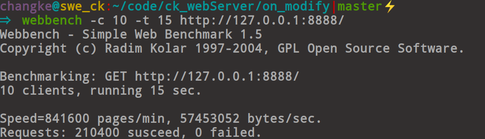
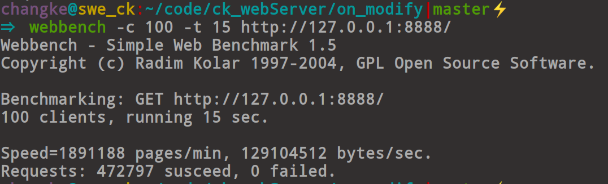

### ck_webServer介绍

ck_webServer是一个web服务器框架，ck是个人简称，所以叫ck_webServer，使用c++11编写！实现了静态页面请求；FastCGI服务，
和基于进程池的CGI服务器实现动态网页的服务。

### 特点

高性能：使用多线程和IO多路复用技术，往每个线程中的epoll加入绑定相同IP+端口的监听套接字，内核作负载均衡，将每个新连接分发到不同线程管理的epoll中，实现高并发，响应速度快！
少内存泄露：使用智能指针管理对象，不会造成内存泄漏问题！
读性能高：对于HTML、CSS文，JS文件等前端文件的读取使用mmap进行直接映射，避免了用户程序和内核页缓存之间的数据拷贝过程！
跨平台的CMake：cmake使用简单的语句来描述所有平台的编译过程，能输出各种makefile，使用cmake进行编译，编译的跨平台性得到了有效提升！
稳定性高：接受过webbench等工具的压测，一般情况下，很少被测崩！

### 实现的功能

静态网页支持传输视频，音频，文档，pdf等(根据这些功能所以此web服务器已经部署到[个人购买的商业服务器](http://changke.fun:3065)中得到应用)，动态网页要使用到CGI或者FastCGI(主机需要有php-fpm服务器的支持)，
此服务器二者都支持，其中CGI是一个基于进程池的CGI服务器的形式运行的！

### 目录说明

|名称|作用|
|:---:|:---:|
|webServer|web服务器|
|cgiServer|进程池CGI服务器|
|serverIntroduction|服务器介绍文档目录|
|www|服务器资源目录|

### 使用说明

进入src目录

sudo apt-get install cmake(已经安装的话跳过)
cmake
cmake CMakeLists.txt
make
./Server IP PORT

### 性能测试

10个客户端，运行15秒
841600page/min

100个客户端运行15秒
1891188page/min

100个客户端运行30秒
2074994page/min

