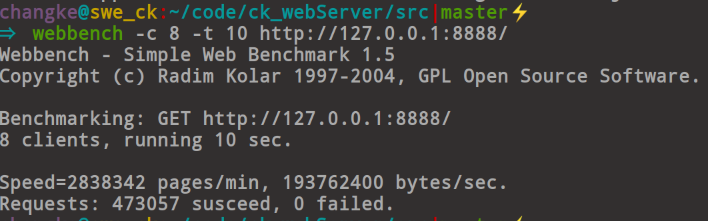
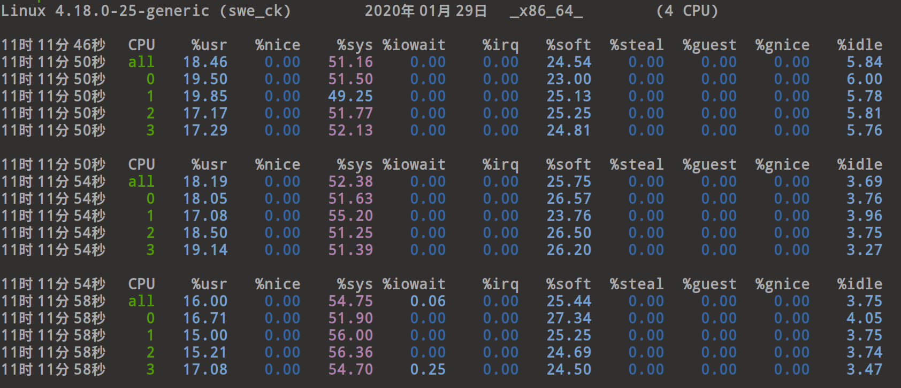
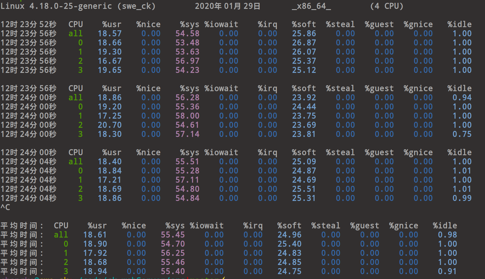

### ck_webServer介绍

ck_webServer是一个web服务器，ck是个人简称，所以叫ck_webServer，使用c++11编写！实现了静态页面请求；FastCGI服务，
和基于进程池的CGI服务器实现动态网页的服务。

### 技术点

- 多线程异步监听设计架构，内核作负载均衡，往应用层各套接字分配新连接。
- 在每一个线程中，使用I/O多路复用epoll对读写事件进行检测，使用回调函数进行处理。
- 设置套接字为非阻塞+ET模式，设计用户缓冲区，对写不完的数据进行保留触发可写事件继续发送。
- 使用单实例模式，多队列对象池为新来的连接分配对象，进行管理，避免频繁创建对象带来的性能损失。
- 支持POST和GET请求，设计进程池CGI服务器在后台运行，处理动态网页请求，并使用FastCgi对php等动态网页进行辅助处理。
- 使用智能指针对对象进行管理，有效避免内存泄漏问题。
- 支持的MIME类型丰富，可以发送视频，音频，pdf，png，pptx等文件。

### 实现的功能

静态网页支持传输视频，音频，文档，pdf，pptx等(已经部署到[个人购买的商业服务器](47.94.238.90:3066)中得到应用)。
动态网处理，像php，表单数据等处理该服务器都支持！

### 目录说明

|名称|作用|
|:---:|:---:|
|webServer|web服务器|
|cgiServer|进程池CGI服务器|
|serverIntroduction|服务器介绍文档目录|
|www|服务器资源目录|

### 使用说明

进入src目录

sudo apt-get install cmake(已经安装的话跳过)

cmake

cmake CMakeLists.txt

make

./Server或./Server IP PORT

### 性能测试

服务器刚开始开了一个线程处理时：

性能：1889808 pages/min  129010544byte/sec


在此期间，四核CPU空闲情况(看idle值越小，说明CPU越繁忙)：


开启8个线程测试情况：

8个连接，持续10秒

性能：2838342 pages/min  193762400 bytes/sec



CPU空闲情况:




多个连接，持续15秒

数据如下：


CPU空闲情况：



使用siege进行测试：


-c 是并发量，指定多少客户端，-r是重复次数

```
Transactions:  500hits (处理次数，本次处理了500次请求)

Availability: 100.00 % (可用性/成功次数的百分比,比如本次100%成功)

Elapsed time: 0.04 secs （运行时间，本次总消耗0.04秒）

Data transferred: 0.01 MB （数据传送量）

Response time: 0.00 secs （响应时间）

Transaction rate: 12500 trans/sec (处理请求频率，每秒钟处理12500次请求）

Throughput: 0.14 MB/sec （吞吐量,传输速度）

Concurrency: 3.50 (实际最高并发连接数)

Successful transactions: 500 (成功的传输次数)

Failed transactions: 0 (失败的传输次数)

Longest transaction: 0.01 (处理传输是所花的最长时间)

Shortest transaction: 0.00 (处理传输是所花的最短时间)

```
